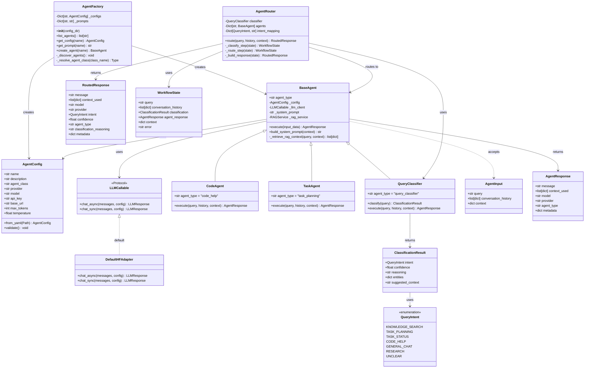

# Agent Core

A library for building agentic AI applications with unified LLM integration via HuggingFace InferenceClient. Provides both synchronous and asynchronous APIs, a config-driven agent framework, and intelligent query routing.

## Features

- Unified LLM client using HuggingFace InferenceClient
- Supports both local inference servers (TGI, vLLM, Ollama, lmStudio) and HuggingFace Hub remote models
- Both synchronous and asynchronous APIs
- Config-driven agent framework with YAML-based agent definitions
- Generic agent implementation - create agents from YAML without writing Python code
- Agent factory for creating agents from configuration
- Query classification for intent detection
- Agent router for intelligent query routing to declared agents

## Installation

To use from wheel

```bash
cd agent_core
uv build .
cd ..
# From the MyAIAssistant root directory
uv pip install -e agent_core/
```

For Mac users, we recommend running [LMStudio](https://lmstudio.ai/) as it supports MLX models, specially optimized for Apple's metal hardware.

## Architecture

The agent framework uses a config-driven design where agents are defined by YAML configuration files and markdown prompt templates, in a specific folder referenced in the confog.yaml file. In fact there are a set of predefined agents, defined as resources in the python library.

```
agent_core/
├── agents/
│   ├── config/                    # Agent configurations
│   │   ├── QueryClassifier/
│   │   │   ├── agent.yaml         # Agent configuration
│   │   │   └── prompt.md          # System prompt template
│   │   ├── CodeAgent/
│   │   │   ├── agent.yaml         # Agent configuration
│   │   │   └── prompt.md          # System prompt template
│   │   └── TaskAgent/
│   ├── base_agent.py              # BaseAgent, AgentInput, AgentResponse
│   ├── factory.py                 # AgentFactory, AgentConfig
│   ├── query_classifier.py        # QueryClassifier agent
│   ├── agent_router.py            # AgentRouter for query routing
│   └── ...
├── client.py                      # LLMClient
├── config.py                      # Configuration utilities
└── types.py                       # Message, LLMResponse
```

### Class Diagram

The following diagram shows the main classes and their relationships:



### Sequence Diagram

The following diagram shows the flow of a query through the agent routing system:

```mermaid
sequenceDiagram
    participant User
    participant Router as AgentRouter
    participant Classifier as QueryClassifier
    participant Factory as AgentFactory
    participant Agent as BaseAgent
    participant LLM as LLMCallable
    participant RAG as RAGService

    User->>Router: route(query, history, context)

    Note over Router: Step 1: Classification
    Router->>Classifier: execute(AgentInput)
    Classifier->>Factory: get_config("QueryClassifier")
    Factory-->>Classifier: AgentConfig
    Classifier->>LLM: chat_async(messages, config)
    LLM-->>Classifier: LLMResponse
    Classifier->>Classifier: parse JSON classification
    Classifier-->>Router: ClassificationResult(intent, confidence, reasoning)
    
    Note over Router: Step 2: Agent Selection
    Router->>Router: map intent to agent_type
    Router->>Factory: create_agent(agent_name)
    Factory->>Factory: load agent.yaml & prompt.md
    Factory->>Factory: resolve agent class
    Factory->>Agent: __init__(config, system_prompt)
    Agent uses _llm_client (default HF or injected)
    Factory-->>Router: Agent instance
    
    Note over Router: Step 3: Agent Execution
    Router->>Router: create AgentInput(query, history, context)
    Router->>Agent: execute(AgentInput)
    
    alt RAG enabled
        Agent->>RAG: search(query, n_results, category)
        RAG-->>Agent: list[SearchResult]
        Agent->>Agent: format_rag_context(results)
    end
    
    Agent->>Agent: build_system_prompt(context)
    Agent->>Agent: build messages (system, history, query)
    Agent->>LLM: chat_async(messages, config)
    LLM-->>Agent: LLMResponse
    Agent->>Agent: create AgentResponse
    Agent-->>Router: AgentResponse(message, context_used, metadata)
    
    Note over Router: Step 4: Build Response
    Router->>Router: _build_response(state)
    Router->>Router: create RoutedResponse
    Router-->>User: RoutedResponse(message, intent, agent_type, metadata)
```

## Agent Factory

The `AgentFactory` discovers and creates agents from YAML configuration files. Each agent is defined by a directory in `agents/config/` containing an `agent.yaml` and  `prompt.md`.

### Using the Factory

```python
from agent_core.agents import AgentFactory

# Create factory (auto-discovers agents from config/)
factory = AgentFactory()

# List available agents
print(factory.list_agents())
# ['QueryClassifier', 'GeneralAgent', 'RAGAgent', 'CodeAgent', 'TaskAgent']
# Note: RAGAgent uses BaseAgent with RAG enabled

# Create an agent by name, the name matches the directory name
agent = factory.create_agent("GeneralAgent")

# Execute the agent
from agent_core.agents import AgentInput
response = await agent.execute(AgentInput(query="Hello, how are you?"))
print(response.message)
print(response.agent_type)  # "general"
print(response.model)       # "gpt-4o-mini"
```

The factory automatically loads agents from YAML configurations. Agents can be defined with or without a `class` field - if omitted, the generic agent implementation is used with the configured prompt and settings.

### Agent Configuration Schema

`AgentConfig` is the unified configuration class that combines agent-specific settings with LLM configuration. Each agent is defined by an `agent.yaml` file:

```yaml
name: GeneralAgent
description: General purpose assistant for conversation
# class field omitted - uses BaseAgent (generic agent)
# provider is always "huggingface", not configurable
model: gpt-4o-mini           # Model identifier
api_key: null                # API key (optional, uses HF_TOKEN env var)
base_url: null               # Base URL for local servers (optional)
temperature: 0.7             # Sampling temperature
max_tokens: 2048             # Max response tokens
timeout: 60.0                # Request timeout in seconds
```

**Generic Agent Usage**: You can create any agent from YAML without specifying a `class` field. When omitted, the factory uses a generic agent implementation that works with any configuration. This allows you to define new agents purely through YAML configuration and prompt templates:

```yaml
name: MyCustomAgent
description: A custom agent defined purely in YAML
# class field omitted - uses generic agent
# provider is always "huggingface", not configurable
model: gpt-4o-mini
temperature: 0.7
max_tokens: 2048
```

Configuration fields:

| Field | Type | Description |
|-------|------|-------------|
| `name` | string | Agent name (matches directory name) |
| `description` | string | Human-readable description |
| `class` | string | Fully qualified Python class name (optional - if omitted, uses generic agent) |
| `model` | string | Model identifier |
| `temperature` | float | Sampling temperature (default: 0.7) |
| `max_tokens` | int | Maximum response tokens (default: 2048) |
| `timeout` | float | Request timeout in seconds (default: 60.0) |

The `class` field is optional. If omitted, the factory uses a generic agent implementation that works with any YAML configuration and prompt template.

### Using AgentConfig Programmatically

```python
from agent_core.agents import BaseAgent, AgentInput
from agent_core.agents.agent_config import AgentConfig

# Create configuration
config = AgentConfig(
    name="MyAgent",
    model="gpt-4o-mini",
    base_url="http://localhost:8080",
    temperature=0.5,
)

# Validate configuration
config.validate()

# BaseAgent uses HuggingFace InferenceClient by default; pass optional llm_client to use a different backend
agent = BaseAgent(config=config)
response = await agent.execute(AgentInput(query="Hello"))
```

### System Prompts

Each agent can have a `prompt.md` file containing the system prompt template:

```markdown
You are a helpful AI assistant.
Be clear and concise in your responses.

## Instructions
- Be helpful and friendly
- Provide accurate information
```

Prompts support template variables using `{variable}` syntax:

```markdown
You are a code assistant.

## Technical Context
Language: {language}
Framework: {framework}

## User Query
{query}
```

### Creating Custom Agents

You can create agents in two ways:

#### Method 1: Generic Agent (YAML-only)

Define a new agent purely through YAML configuration and prompt template. No Python code required:

```
agents/config/MyCustomAgent/
├── agent.yaml
└── prompt.md
```

Create the `agent.yaml` without a `class` field:

```yaml
name: MyCustomAgent
description: My custom agent defined in YAML
# class field omitted - uses generic agent
# provider is always "huggingface", not configurable
model: gpt-4o-mini
temperature: 0.7
max_tokens: 2048
```

Create a `prompt.md` with the system prompt:

```markdown
You are a specialized assistant for my custom domain.

## Instructions
- Provide accurate and helpful responses
- Use the context provided to inform your answers
```

The factory will automatically use the generic agent implementation with your configuration and prompt.

#### Method 2: Custom Python Class

For agents requiring custom logic, create a Python class extending `BaseAgent`:

```yaml
name: MyCustomAgent
description: My custom agent with specialized logic
class: my_package.agents.MyCustomAgent
# provider is always "huggingface", not configurable
model: gpt-4o-mini
temperature: 0.7
max_tokens: 2048
```

Create the Python class:

```python
# my_package/agents.py
from agent_core.agents import BaseAgent, AgentResponse

class MyCustomAgent(BaseAgent):
    agent_type = "my_custom"
    
    async def execute(self, query, conversation_history=None, context=None):
        # Custom execution logic
        system_prompt = self.build_system_prompt(context)
        messages = [
            {"role": "system", "content": system_prompt},
            {"role": "user", "content": query}
        ]
        response = await self._call_llm(messages)
        return AgentResponse(
            message=response,
            model=self.model,
            provider="huggingface",
            agent_type=self.agent_type
        )
```

The factory will dynamically import your class using the fully qualified name.

Alternatively, register a class manually for short name access:

```python
from agent_core.agents import AgentFactory
from my_package.agents import MyCustomAgent

AgentFactory.register_class("my_package.agents.MyCustomAgent", MyCustomAgent)
```

## Base Types

### AgentInput

Standard input structure for agent execution:

```python
from agent_core.agents import AgentInput

input_data = AgentInput(
    query="What is OAuth?",
    conversation_history=[
        {"role": "user", "content": "Hello"},
        {"role": "assistant", "content": "Hi there!"}
    ],
    context={"task_id": "123"}
)
```

Input fields:

| Field | Type | Description |
|-------|------|-------------|
| `query` | string | The user's input query |
| `conversation_history` | list[dict] | Previous messages in the conversation |
| `context` | dict | Additional context (entities, metadata, task info, etc.) |

### AgentResponse

Standard response structure from agent execution with full execution context:

```python
from agent_core.agents import AgentResponse

response = AgentResponse(
    message="Response text",
    context_used=[{"title": "doc.md", "uri": "path/to/doc"}],
    model="gpt-4o-mini",
    provider="huggingface",
    agent_type="rag",
    metadata={"search_query": "oauth"}
)
```

Response fields:

| Field | Type | Description |
|-------|------|-------------|
| `message` | string | The agent's response message |
| `context_used` | list[dict] | List of context documents used (for RAG agents) |
| `model` | string | Model identifier used for generation |
| `provider` | string | LLM provider name |
| `agent_type` | string | Type identifier of the agent |
| `metadata` | dict | Additional metadata (intent, confidence, etc.) |


## Query Classification

The `QueryClassifier` analyzes user queries to determine intent for routing:

```python
from agent_core.agents import AgentFactory

factory = AgentFactory()
classifier = factory.create_agent("QueryClassifier")

# Use the execute() method for standard agent interface
response = await classifier.execute(AgentInput(query="How do I implement OAuth?"))
print(response.metadata["intent"])  # "code_help"

# Or use classify() for ClassificationResult
result = await classifier.classify("How do I implement OAuth?")
```

### Supported Intents

| Intent | Description |
|--------|-------------|
| `KNOWLEDGE_SEARCH` | Information retrieval from knowledge base |
| `TASK_PLANNING` | Task breakdown and planning |
| `TASK_STATUS` | Status of existing tasks |
| `CODE_HELP` | Programming assistance |
| `GENERAL_CHAT` | General conversation |
| `RESEARCH` | Research queries |
| `UNCLEAR` | Ambiguous queries needing clarification |

## Agent Routing

The `AgentRouter` classifies queries and routes them to specialized agents:

```python
from agent_core.agents import AgentRouter, QueryIntent, get_agent_router

# Use the default router (auto-configured with all agents)
router = get_agent_router()

# Route a query
response = await router.route("How do I implement OAuth?")
print(response.message)      # Response from code_agent
print(response.intent)       # QueryIntent.CODE_HELP
print(response.agent_type)   # "code_help"

# Force a specific intent
response = await router.route(
    "What is OAuth?",
    force_intent=QueryIntent.KNOWLEDGE_SEARCH
)
```

### Custom Router Configuration

```python
from agent_core.agents import AgentRouter, QueryClassifier, QueryIntent

# Create custom agents
# RAGAgent is BaseAgent with RAG enabled (configured via agent.yaml)
rag_agent = factory.create_agent("RAGAgent")
code_agent = factory.create_agent("CodeAgent")
general_agent = factory.create_agent("GeneralAgent")  # Uses BaseAgent

# Create router with custom configuration
router = AgentRouter(
    classifier=factory.create_agent("QueryClassifier"),
    agents={
        "rag": rag_agent,
        "code": code_agent,
        "general": general_agent,
    },
    intent_mapping={
        QueryIntent.KNOWLEDGE_SEARCH: "rag",
        QueryIntent.CODE_HELP: "code",
        QueryIntent.GENERAL_CHAT: "general",
    },
    default_agent="general"
)
```

## Testing

```bash
# Run unit tests
uv run pytest tests/ut/ -v

# Run integration tests
uv run pytest tests/it/ -v -m integration

# Run specific test file
uv run pytest tests/ut/test_agent_factory.py -v
```

## API Reference

### Factory Functions

```python
from agent_core.agents import (
    AgentFactory,           # Factory class
    AgentConfig,            # Configuration model (Pydantic BaseModel)
    get_agent_factory,      # Get singleton factory
    reset_agent_factory,    # Reset singleton (for testing)
)
```

### Agent Base Classes

```python
from agent_core.agents import (
    BaseAgent,              # Base agent class (can be used generically)
    AgentInput,             # Standard input structure
    AgentResponse,          # Standard response structure with context
)
```

### Query Classification

```python
from agent_core.agents import (
    QueryClassifier,        # Classifier agent
    QueryIntent,            # Intent enum
    ClassificationResult,   # Classification output
    CLASSIFICATION_PROMPT,  # Default prompt template
)
```

### Routing

```python
from agent_core.agents import (
    AgentRouter,            # Router class
    WorkflowState,          # Internal state
    RoutedResponse,         # Router response
    get_agent_router,       # Get singleton router
    reset_agent_router,     # Reset singleton
)
```
