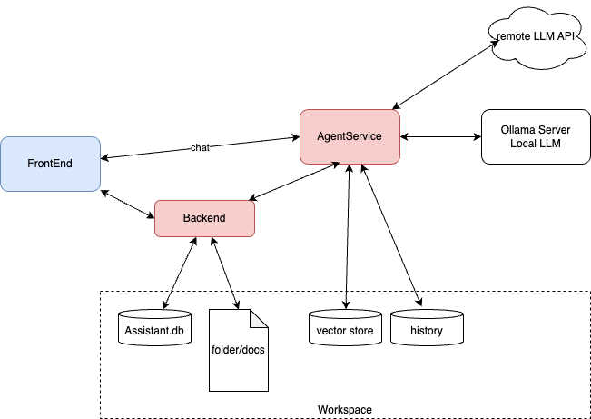

# Agent Service

Update 03/17/2026

Agno + AgentOS microservice for MyAIAssistant: chat, knowledge, RAG, meeting extract, and task tagging... 

The frontend of MyAIAssistant goes directly to the endpoints exposed by AgentService. The backend calls also from its own API to delegate to certain agents.



AgentOS  delivers a powerful REST API to be usable by any clients and the frontend, and encapsulates a lot of lower level constructs like system prompt, tools, llm,...

## Implementation goals

* The AI agents are defined in yaml, with their prompt and use a generic Python class for most of use cases. Base class delegates to agno.Agent class. Externalize the configuration of the agent, brings the advantage of having the user defining its own tools, temperature, llm reference, and system prompt for dedicated use case in the workspace.
* When there is a need to do workflow, team, it is possible to define custom agent class.
* the agent_factory helps to load yaml definitions from agent_service code or local workspace.
* Support RAG operations on documents referenced by users and in knowledge db

The Agno Agents are wrapped by AIAgent, to map the loaded the configuration from the Yaml.

The general purpose agent is the base_ai_agent. It has tooks to search the web, knowledge and reasoning capability.

### Features

* [x] AgnoOS is serving APIs - [http://localhost:8100/docs](http://localhost:8100/docs)
* [x] AgentFactory is able to load config from config folder or workspace/agents folder. Agents are visible as Agents in the 
    ```sh
    curl -X 'GET'  'http://localhost:8100/agents'  -H 'accept: application/json'
    ```
* [ ] The agents will use local llm to support memory operations. 
* [ ] User can configure remote LLM.


## Run locally

Start the backend for integration tests.

```bash
cd agent_service
./start_dev_mode.sh
```

To get realistic data for testing, the test_wksp folder represents a workspace with documents, vector store, and ai.db.

## Endpoints (frontend direct or backend proxy)

- `GET /health` – liveness
- `POST /agents/<agentId>/runs`

Backend: set `AGENT_SERVICE_URL=http://localhost:8100` (or `http://agent-service:8100` in Compose) to use this service.

## Customer index normalizer

CLI to rewrite `customers/*/index.md` notes into a fixed Markdown section template (products, champion, Confluent, use case, context, architecture, past/next steps, sources), merge stray sections into the closest canonical block, and improve English without inventing facts. Uses Agno with structured output and the same LLM env vars as the rest of agent_service (`LLM_BASE_URL` / `OLLAMA_BASE_URL`, `LLM_MODEL`, `LLM_API_KEY`).

```bash
cd agent_service
export CUSTOMERS_ROOT=/path/to/project_notes/business/customers
# Preview one account on stdout (use --only when multiple customer folders exist)
uv run normalize-customer-indexes --customers-root "$CUSTOMERS_ROOT" --only Highmark

# Write sidecar files for all accounts
uv run normalize-customer-indexes --customers-root "$CUSTOMERS_ROOT" --output-sibling

# Overwrite in place with backup
uv run normalize-customer-indexes --customers-root "$CUSTOMERS_ROOT" --write --backup
```

Module: `agent_service.tools.customer_index_normalize`. Alternate entry: `uv run python scripts/normalize_customer_indexes.py`.

## Legacy customer index → MyAIAssistant import

Migrate a monolithic engagement note (e.g. `customers/*/index.md`) into an **organization**, **project**, and **meeting refs** using Agno structured extraction and the MyAIAssistant REST API (`/api/organizations`, `/api/projects`, `/api/meeting-refs`). Same LLM env vars as the rest of agent_service.

```bash
cd agent_service
uv sync --extra dev

# Preview extraction only (JSON to stdout)
export LLM_BASE_URL=... LLM_MODEL=... LLM_API_KEY=...
uv run migrate-customer-index --file /path/to/index.md --only-extract

# Preview planned REST payloads after extraction (no backend calls)
uv run migrate-customer-index --file /path/to/index.md --dry-run

# Persist (backend must be running)
export MYAI_BACKEND_URL=http://localhost:8000
uv run migrate-customer-index --file /path/to/index.md --folder-slug att

# Save extraction JSON for review
uv run migrate-customer-index --file /path/to/index.md --only-extract --json-out /tmp/extract.json
```

**HTTP (agent_service):** `POST /extract/customer-index` with JSON body `{ "content": "<markdown>", "folder_slug": "optional" }` returns the same structured object as `--only-extract` (no persistence).

**Behavior:** Organizations and projects are matched by name (`GET .../search/by-name`); existing records are reused. Duplicate `meeting_id` returns **409** from the backend — the CLI logs a warning and skips that meeting. Relative images in legacy markdown are **not** copied automatically; fix paths or copy assets separately after import.

| Env | Default | Description |
|-----|---------|-------------|
| `MYAI_BACKEND_URL` | `http://localhost:8000` | MyAIAssistant FastAPI base URL for the migrator CLI. |

## Tests

Unit tests are under `tests/ut` and do not need agent_service server to run.

Integration tests live under `tests/it/` and assert the HTTP contract (paths, request/response shapes, validation). They use httpx client, so the agent_service server needs to run, using `./start_dev_mode.sh`

```bash
uv sync --extra dev
uv run pytest tests/it -v
```

## Config

| Env | Default | Description |
|-----|---------|-------------|
| `OLLAMA_BASE_URL` | `http://127.0.0.1:11434` | Ollama server (chat + embeddings). LLM API at `{OLLAMA_BASE_URL}/v1`. |
| `VS_DB_URL` | `data/vs.db` | LanceDB path for RAG vectors |
| `KNOWLEDGE_EMBEDDER_MODEL` | `nomic-embed-text` | Embedder model id |
| `AGENT_DB_PATH` | `data/agents.db` | Sqlite path for agent history |
| `CORS_ORIGINS` | `http://localhost:3000,http://127.0.0.1:3000` | Comma-separated origins allowed for browser requests (frontend-direct mode). |
| `TRACE_LLM_PROMPT` or `AGNO_DEBUG` | unset | Set to `1`, `true`, or `yes` to log the prompt (messages) sent to the LLM at DEBUG level. Uses agno debug mode; output appears in the agent_service process stdout. |
| `CUSTOMERS_ROOT` | unset | Used by `normalize-customer-indexes` when `--customers-root` is omitted. |
| `MYAI_BACKEND_URL` | `http://localhost:8000` | Used by `migrate-customer-index` when `--backend-url` is omitted. |
| `LLM_MODEL` | `llama3.2` | Model id for OpenAI-compatible endpoint. |
| `LLM_API_KEY` | `no-key` | API key when the server requires it. |
| `LLM_BASE_URL` | derived from `OLLAMA_BASE_URL` | OpenAI-compatible base URL (default adds `/v1`). |


## Implementation Review

* Agno use one database to keep memory of the conversation. The database is shared with AgentOS and the other agents.
* [MemoryManager](https://docs.agno.com/reference/memory/memory#memory-manager)to manage conversation history, session summaries, and long-term user memories for AI agents.
