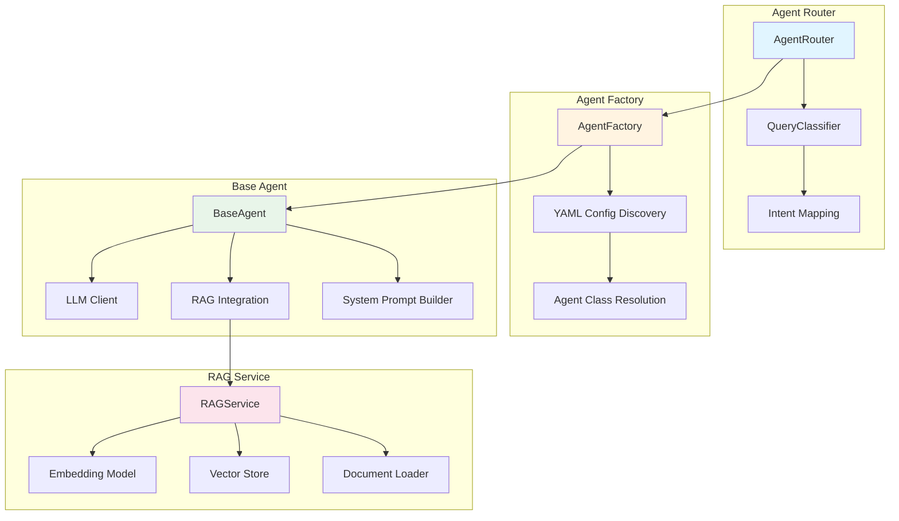
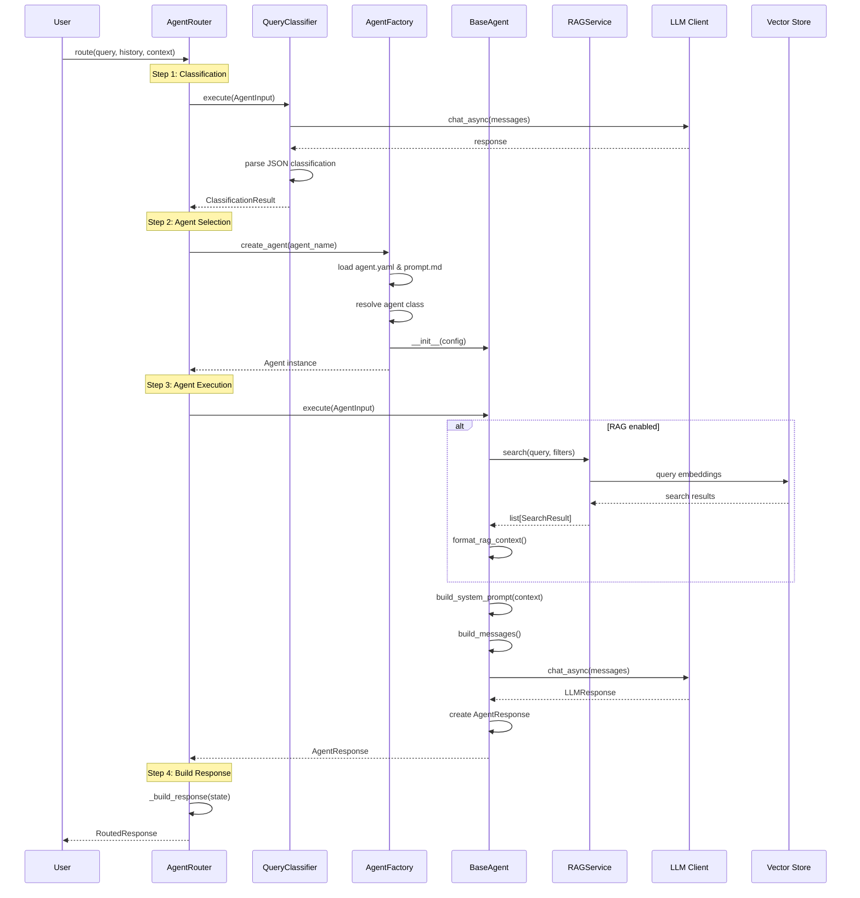
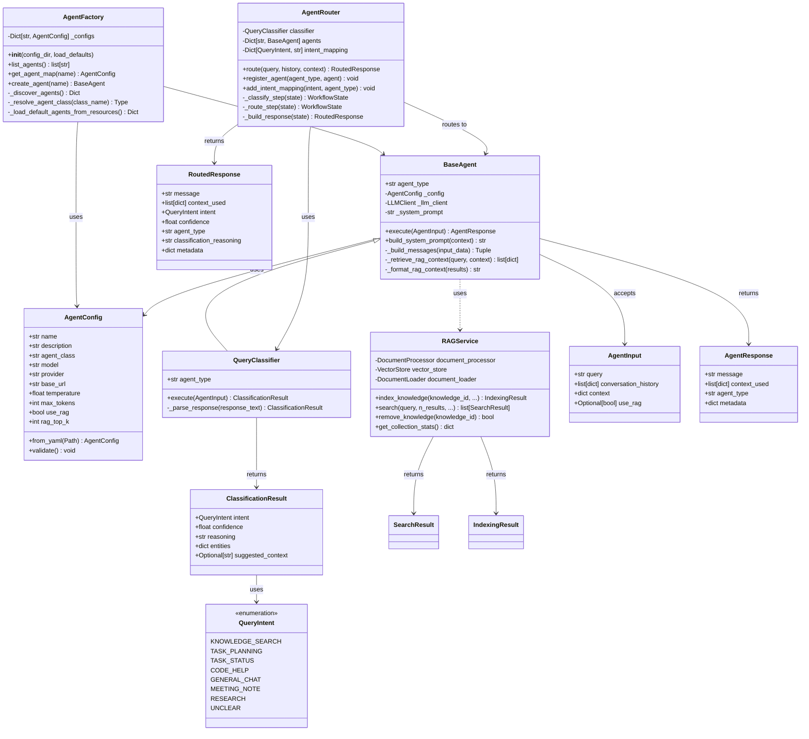

# Agent Core Library

The `agent_core` library provides a config-driven framework for building agentic AI applications with unified LLM integration, intelligent query routing, and RAG capabilities.

## Architecture Overview

The agent core follows a modular architecture with clear separation of concerns:



### Query Execution Flow

The following sequence diagram illustrates how a query flows through the agent core system:



### Class Relationships

The following class diagram shows the relationships between core classes:



## Core Components

### Agent Factory

The `AgentFactory` discovers and creates agents from YAML configuration files. It supports both filesystem-based and package resource-based agent definitions.

**Key Features:**
- Automatic discovery of agents from configuration directories
- Support for default agents shipped as package resources
- Dynamic class loading from fully qualified names
- Generic agent support (no Python code required)

**Usage:**

```python
from agent_core.agents.agent_factory import AgentFactory, get_agent_factory

# Create factory with custom config directory
factory = AgentFactory(config_dir="/path/to/agent/configs")

# Or use singleton
factory = get_agent_factory()

# List available agents
agents = factory.list_agents()
# ['QueryClassifier', 'GeneralAgent', 'CodeAgent', 'TaskAgent']

# Create an agent
agent = factory.create_agent("GeneralAgent")
```

**Configuration Discovery:**

The factory loads agents in two phases:

1. **Default Agents**: Loaded from package resources (`agent_core.agents.config`)
2. **User Agents**: Loaded from filesystem config directory (overrides defaults)

Each agent is defined by a directory containing:
- `agent.yaml` - Agent configuration
- `prompt.md` - System prompt template (optional)

### Agent Configuration

Agents are configured via YAML files using the `AgentConfig` model:

```yaml
name: GeneralAgent
description: General purpose assistant
class: agent_core.agents.base_agent.BaseAgent  # Optional
model: mistral:7b-instruct
provider: huggingface
base_url: http://localhost:11434/v1
temperature: 0.7
max_tokens: 4096
use_rag: false
rag_top_k: 5
rag_category: null
```

**Configuration Fields:**

| Field | Type | Description |
|-------|------|-------------|
| `name` | string | Agent name (matches directory name) |
| `description` | string | Human-readable description |
| `class` | string | Fully qualified Python class name (optional) |
| `model` | string | Model identifier |
| `provider` | string | LLM provider (currently always "huggingface") |
| `api_key` | string | API key for remote models (optional) |
| `base_url` | string | Base URL for local inference servers |
| `temperature` | float | Sampling temperature (0.0-2.0) |
| `max_tokens` | int | Maximum response tokens |
| `timeout` | float | Request timeout in seconds |
| `use_rag` | bool | Enable RAG for this agent |
| `rag_top_k` | int | Number of RAG results to retrieve |
| `rag_category` | string | Default category filter for RAG |

### Base Agent

The `BaseAgent` class provides the foundation for all agents. It handles:

- LLM client initialization
- System prompt loading and templating
- RAG context retrieval and formatting
- Message building for LLM calls
- Response formatting

**Key Methods:**

```python
class BaseAgent:
    async def execute(self, input_data: AgentInput) -> AgentResponse:
        """Execute the agent with input data."""
        
    def build_system_prompt(self, context: Optional[dict] = None) -> str:
        """Build system prompt with optional context substitution."""
        
    async def _retrieve_rag_context(self, query: str, context: dict) -> list[dict]:
        """Retrieve relevant context from RAG service."""
        
    def _format_rag_context(self, results: list[dict]) -> str:
        """Format RAG results for LLM context."""
```

**System Prompt Templating:**

Prompts support template variables using `{variable}` syntax:

```markdown
You are a {role} assistant.

## Context
Current task: {task_name}
Priority: {priority}
```

Variables are substituted from the `context` dict passed to `execute()`:

```python
response = await agent.execute(AgentInput(
    query="Help me with this",
    context={
        "role": "code",
        "task_name": "Implement OAuth",
        "priority": "high"
    }
))
```

### Query Classifier

The `QueryClassifier` analyzes user queries to determine intent for routing:

```python
from agent_core.agents.query_classifier import QueryClassifier, QueryIntent

classifier = QueryClassifier(config=agent_config)

result = await classifier.execute(AgentInput(query="How do I implement OAuth?"))
# Returns ClassificationResult with:
# - intent: QueryIntent.CODE_HELP
# - confidence: 0.95
# - reasoning: "Query asks about implementation..."
# - entities: {"topic": "OAuth", "keywords": ["implement"]}
```

**Supported Intents:**

| Intent | Description |
|--------|-------------|
| `KNOWLEDGE_SEARCH` | Information retrieval from knowledge base |
| `TASK_PLANNING` | Task breakdown and planning |
| `TASK_STATUS` | Status of existing tasks |
| `CODE_HELP` | Programming assistance |
| `GENERAL_CHAT` | General conversation |
| `MEETING_NOTE` | Meeting note processing |
| `RESEARCH` | Research queries |
| `UNCLEAR` | Ambiguous queries needing clarification |

### Agent Router

The `AgentRouter` orchestrates the classification and routing workflow:

1. **Classification**: Determines query intent
2. **Agent Selection**: Maps intent to agent type
3. **Execution**: Runs selected agent
4. **Response**: Returns formatted response with metadata

**Usage:**

```python
from agent_core.agents.agent_router import AgentRouter

router = AgentRouter(config_dir="/path/to/configs")

response = await router.route(
    query="How do I implement OAuth?",
    conversation_history=[],
    context={}
)

print(response.message)           # Agent response
print(response.intent)             # QueryIntent.CODE_HELP
print(response.agent_type)         # "code_help"
print(response.confidence)         # 0.95
print(response.classification_reasoning)  # "Query asks about..."
```

**Default Intent Mapping:**

```python
DEFAULT_INTENT_MAPPING = {
    QueryIntent.KNOWLEDGE_SEARCH: "knowledge_search",
    QueryIntent.TASK_PLANNING: "task_planning",
    QueryIntent.TASK_STATUS: "task_status",
    QueryIntent.CODE_HELP: "code_help",
    QueryIntent.GENERAL_CHAT: "general_chat",
    QueryIntent.UNCLEAR: "unclear",
}
```

**Custom Routing:**

```python
router = AgentRouter()

# Register custom agent
router.register_agent("custom_agent", my_custom_agent)

# Map intent to agent
router.add_intent_mapping(QueryIntent.RESEARCH, "custom_agent")
```

### RAG Integration

Agents can use RAG by setting `use_rag: true` in their configuration or passing `use_rag=True` in the input:

```python
# Enable RAG in agent config
config = AgentConfig(
    name="RAGAgent",
    use_rag=True,
    rag_top_k=5,
    rag_category="Engineering"
)

# Or override per-request
response = await agent.execute(AgentInput(
    query="How to configure database?",
    use_rag=True,
    context={"rag_category": "DevOps"}
))
```

**RAG Context Flow:**

1. Agent calls `_retrieve_rag_context(query, context)`
2. RAG service searches vector store with filters
3. Results formatted and added to system messages
4. LLM receives query with retrieved context

**RAG Context Format:**

```python
[
    {
        "content": "Document content...",
        "title": "Document Title",
        "uri": "/path/to/doc.md",
        "score": 0.87,
        "knowledge_id": 123
    }
]
```

## Data Models

### AgentInput

Standard input structure for agent execution:

```python
class AgentInput(BaseModel):
    query: str
    conversation_history: list[dict] = Field(default_factory=list)
    context: dict = Field(default_factory=dict)
    use_rag: Optional[bool] = None  # Override agent's RAG setting
```

### AgentResponse

Standard response structure:

```python
class AgentResponse(BaseModel):
    message: str
    context_used: list[dict] = Field(default_factory=list)
    agent_type: str = ""
    metadata: dict = Field(default_factory=dict)
```

### RoutedResponse

Response from the router with classification metadata:

```python
class RoutedResponse(BaseModel):
    message: str
    context_used: list[dict]
    intent: QueryIntent
    confidence: float
    agent_type: str
    classification_reasoning: str
    metadata: dict[str, Any] = Field(default_factory=dict)
```

## Extending Agent Core

### Creating Custom Agents

#### Method 1: Generic Agent (YAML-only)

Create an agent without writing Python code:

1. Create agent directory:

```
agent_core/agents/config/MyCustomAgent/
├── agent.yaml
└── prompt.md
```

2. Define `agent.yaml`:

```yaml
name: MyCustomAgent
description: Custom agent for specific domain
# class field omitted - uses BaseAgent
model: mistral:7b-instruct
temperature: 0.7
max_tokens: 2048
use_rag: true
rag_top_k: 5
```

3. Create `prompt.md`:

```markdown
You are a specialized assistant for {domain}.

## Instructions
- Provide accurate and helpful responses
- Use the context provided to inform your answers
- Focus on {domain} best practices
```

4. Use the agent:

```python
factory = AgentFactory()
agent = factory.create_agent("MyCustomAgent")

response = await agent.execute(AgentInput(
    query="Help with my domain question",
    context={"domain": "machine learning"}
))
```

#### Method 2: Custom Python Class

For agents requiring custom logic, extend `BaseAgent`:

1. Create Python class:

```python
# my_package/agents.py
from agent_core.agents.base_agent import BaseAgent, AgentInput, AgentResponse

class MyCustomAgent(BaseAgent):
    agent_type = "my_custom"
    
    async def execute(self, input_data: AgentInput) -> AgentResponse:
        # Custom preprocessing
        processed_query = self._preprocess_query(input_data.query)
        
        # Build custom messages
        messages = await self._build_messages(AgentInput(
            query=processed_query,
            conversation_history=input_data.conversation_history,
            context=input_data.context
        ))
        
        # Call LLM
        response = await self._llm_client.chat_async(
            messages=messages[0], 
            config=self._config
        )
        
        # Post-process response
        formatted_message = self._format_response(response.content)
        
        return AgentResponse(
            message=formatted_message,
            agent_type=self.agent_type,
            metadata={"preprocessed": True}
        )
    
    def _preprocess_query(self, query: str) -> str:
        """Custom query preprocessing."""
        return query.upper()  # Example
    
    def _format_response(self, response: str) -> str:
        """Custom response formatting."""
        return f"[FORMATTED] {response}"
```

2. Register the class:

```python
# Option A: Use fully qualified name in YAML
# agent.yaml:
# class: my_package.agents.MyCustomAgent

# Option B: Register manually
from agent_core.agents.agent_factory import AgentFactory
from my_package.agents import MyCustomAgent

AgentFactory.register_class("MyCustomAgent", MyCustomAgent)
```

3. Create `agent.yaml`:

```yaml
name: MyCustomAgent
description: Custom agent with specialized logic
class: my_package.agents.MyCustomAgent
model: mistral:7b-instruct
temperature: 0.7
```

#### Method 3: Override Specific Methods

Extend `BaseAgent` and override specific methods:

```python
class CustomRAGAgent(BaseAgent):
    agent_type = "custom_rag"
    
    async def _retrieve_rag_context(self, query: str, context: dict) -> list[dict]:
        """Custom RAG retrieval logic."""
        # Add custom filtering
        category = context.get("category", "default")
        
        # Call parent method with custom filters
        results = await super()._retrieve_rag_context(query, {
            **context,
            "rag_category": category,
            "rag_top_k": 10  # Override top_k
        })
        
        # Post-process results
        return self._filter_results(results)
    
    def _filter_results(self, results: list[dict]) -> list[dict]:
        """Filter results by custom criteria."""
        return [r for r in results if r["score"] > 0.8]
```

### Adding New Query Intents

1. Extend `QueryIntent` enum:

```python
# agent_core/agents/query_classifier.py
class QueryIntent(str, Enum):
    # ... existing intents ...
    CUSTOM_INTENT = "custom_intent"
```

2. Update classifier prompt:

The classifier's prompt should be updated to recognize the new intent. Edit `agent_core/agents/config/QueryClassifier/prompt.md`:

```markdown
## Intent Categories

- custom_intent: Queries related to [description]
```

3. Add intent mapping in router:

```python
router = AgentRouter()
router.add_intent_mapping(QueryIntent.CUSTOM_INTENT, "custom_agent")
```

### Extending RAG Service

#### Custom Document Loader

```python
from agent_core.services.rag.document_loader import DocumentLoader, LoadedDocument

class CustomDocumentLoader(DocumentLoader):
    async def load(self, uri: str, document_type: str) -> list[LoadedDocument]:
        if document_type == "custom_type":
            return await self._load_custom_type(uri)
        return await super().load(uri, document_type)
    
    async def _load_custom_type(self, uri: str) -> list[LoadedDocument]:
        # Custom loading logic
        content = await self._fetch_custom_content(uri)
        return [LoadedDocument(
            content=content,
            document_id=f"custom_{uri}",
            content_hash=hashlib.sha256(content.encode()).hexdigest(),
            source_uri=uri,
            title="Custom Document"
        )]
```

#### Custom Text Splitter

```python
from agent_core.services.rag.text_splitter import RecursiveTextSplitter, TextChunk

class CustomTextSplitter(RecursiveTextSplitter):
    def split_text(self, text: str, metadata: dict = None) -> list[TextChunk]:
        # Custom splitting logic
        # For example, split by code blocks
        chunks = []
        code_blocks = re.findall(r'```[\s\S]*?```', text)
        
        for i, block in enumerate(code_blocks):
            chunks.append(TextChunk(
                content=block,
                start_index=text.find(block),
                chunk_index=i,
                metadata=metadata or {}
            ))
        
        return chunks
```

#### Custom Vector Store

```python
from agent_core.services.rag.vector_store import VectorStore

class CustomVectorStore(VectorStore):
    def search(self, query: str, **kwargs) -> SearchResults:
        # Custom search logic
        # For example, hybrid search combining vector and keyword search
        vector_results = super().search(query, **kwargs)
        keyword_results = self._keyword_search(query, **kwargs)
        
        return self._merge_results(vector_results, keyword_results)
```

### Custom LLM Provider

The library uses a provider factory pattern. To add a custom provider:

1. Create provider class:

```python
from agent_core.providers.llm_provider_base import LLMProviderBase
from agent_core.types import LLMResponse, Message

class CustomLLMProvider(LLMProviderBase):
    async def chat_async(
        self, 
        messages: list[Message], 
        config: AgentConfig
    ) -> LLMResponse:
        # Custom LLM API call
        response = await self._call_custom_api(messages, config)
        return LLMResponse(content=response)
    
    def chat(
        self, 
        messages: list[Message], 
        config: AgentConfig
    ) -> LLMResponse:
        # Synchronous version
        return asyncio.run(self.chat_async(messages, config))
```

2. Register with factory:

```python
from agent_core.providers.llm_provider_factory import LLMProviderFactory

LLMProviderFactory.register_provider("custom", CustomLLMProvider)
```

3. Use in agent config:

```yaml
name: CustomAgent
provider: custom
model: custom-model-name
```

## Workflow Examples

### Simple Agent Execution

```python
from agent_core.agents.agent_factory import get_agent_factory
from agent_core.agents.base_agent import AgentInput

factory = get_agent_factory()
agent = factory.create_agent("GeneralAgent")

response = await agent.execute(AgentInput(
    query="What is Python?",
    conversation_history=[],
    context={}
))

print(response.message)
```

### RAG-Enabled Agent

```python
# Create agent with RAG enabled
factory = get_agent_factory()
agent = factory.create_agent("RAGAgent")  # Assumes RAGAgent config has use_rag: true

response = await agent.execute(AgentInput(
    query="How to configure OAuth?",
    context={
        "rag_category": "Security",
        "knowledge_ids": [1, 2, 3]
    }
))

print(response.message)
print(f"Used {len(response.context_used)} context documents")
for ctx in response.context_used:
    print(f"  - {ctx['title']} (score: {ctx['score']:.2f})")
```

### Router with Custom Agents

```python
from agent_core.agents.agent_router import AgentRouter
from agent_core.agents.query_classifier import QueryIntent

# Create custom agents
factory = get_agent_factory()
custom_agent = factory.create_agent("MyCustomAgent")

# Create router
router = AgentRouter()

# Register custom agent
router.register_agent("custom", custom_agent)

# Map intent to agent
router.add_intent_mapping(QueryIntent.CUSTOM_INTENT, "custom")

# Route query
response = await router.route("Custom query here")
```

### Context-Aware Agent

```python
agent = factory.create_agent("GeneralAgent")

# Pass context for prompt templating
response = await agent.execute(AgentInput(
    query="Help me with this task",
    context={
        "role": "senior engineer",
        "task_name": "Implement authentication",
        "priority": "high",
        "deadline": "2026-02-01"
    }
))

# System prompt will substitute {role}, {task_name}, etc.
```

## Testing

### Unit Testing Agents

```python
import pytest
from agent_core.agents.agent_factory import AgentFactory
from agent_core.agents.base_agent import AgentInput

@pytest.mark.asyncio
async def test_custom_agent():
    factory = AgentFactory()
    agent = factory.create_agent("MyCustomAgent")
    
    response = await agent.execute(AgentInput(
        query="Test query",
        context={"domain": "testing"}
    ))
    
    assert response.message is not None
    assert response.agent_type == "my_custom"
```

### Testing Router

```python
@pytest.mark.asyncio
async def test_router_routing():
    router = AgentRouter()
    
    response = await router.route("How do I implement OAuth?")
    
    assert response.intent == QueryIntent.CODE_HELP
    assert response.agent_type == "code_help"
    assert response.confidence > 0.7
```

### Mocking RAG Service

```python
from unittest.mock import AsyncMock, patch

@pytest.mark.asyncio
async def test_agent_with_rag():
    with patch('agent_core.agents.base_agent.RAGService') as mock_rag:
        mock_rag.return_value.search = AsyncMock(return_value=[
            {
                "content": "Test content",
                "title": "Test Doc",
                "uri": "/test.md",
                "score": 0.9,
                "knowledge_id": 1
            }
        ])
        
        agent = factory.create_agent("RAGAgent")
        response = await agent.execute(AgentInput(
            query="Test query",
            use_rag=True
        ))
        
        assert len(response.context_used) > 0
```

## Best Practices

### Agent Design

1. **Use generic agents when possible**: YAML-only agents are easier to maintain and modify
2. **Keep custom logic minimal**: Override only necessary methods
3. **Leverage context**: Use context dict for prompt templating and RAG filtering
4. **Handle errors gracefully**: Return meaningful error messages in responses

### Configuration Management

1. **Use environment variables**: For sensitive data like API keys
2. **Version control configs**: Keep agent YAML files in version control
3. **Document prompts**: Add comments in prompt.md explaining the agent's purpose
4. **Test configurations**: Validate agent configs before deployment

### RAG Integration

1. **Filter appropriately**: Use category and knowledge_ids to narrow search
2. **Tune top_k**: Balance between context and noise
3. **Monitor scores**: Log RAG scores to improve retrieval
4. **Update regularly**: Re-index documents when content changes

### Performance

1. **Cache agents**: Reuse agent instances when possible
2. **Async operations**: Use async/await for I/O operations
3. **Batch RAG queries**: When processing multiple queries
4. **Monitor LLM calls**: Track token usage and latency

## Troubleshooting

### Agent Not Found

**Error**: `ValueError: Unknown agent: MyAgent`

**Solution**: 
- Check agent name matches directory name
- Verify `agent.yaml` exists in agent directory
- Ensure factory is loading from correct config directory

### Class Import Error

**Error**: `ValueError: Failed to import agent class 'my_module.MyAgent'`

**Solution**:
- Verify fully qualified class name is correct
- Ensure module is in Python path
- Check class extends `BaseAgent`

### RAG Not Working

**Error**: No context retrieved despite `use_rag=True`

**Solution**:
- Verify RAG service is initialized
- Check vector store has indexed documents
- Verify category/knowledge_ids filters are correct
- Check RAG service logs for errors

### Prompt Not Loading

**Error**: Agent uses default prompt instead of custom

**Solution**:
- Verify `prompt.md` exists in agent directory
- Check file encoding (should be UTF-8)
- Ensure agent_dir is set correctly in config

## API Reference

### Factory Functions

```python
from agent_core.agents.agent_factory import (
    AgentFactory,
    AgentConfig,
    get_agent_factory,
    reset_agent_factory
)
```

### Agent Classes

```python
from agent_core.agents.base_agent import (
    BaseAgent,
    AgentInput,
    AgentResponse
)
```

### Router

```python
from agent_core.agents.agent_router import (
    AgentRouter,
    RoutedResponse,
    WorkflowState
)
```

### Query Classification

```python
from agent_core.agents.query_classifier import (
    QueryClassifier,
    QueryIntent,
    ClassificationResult
)
```

### RAG Service

```python
from agent_core.services.rag.service import (
    RAGService,
    get_rag_service,
    SearchResult,
    IndexingResult
)
```
