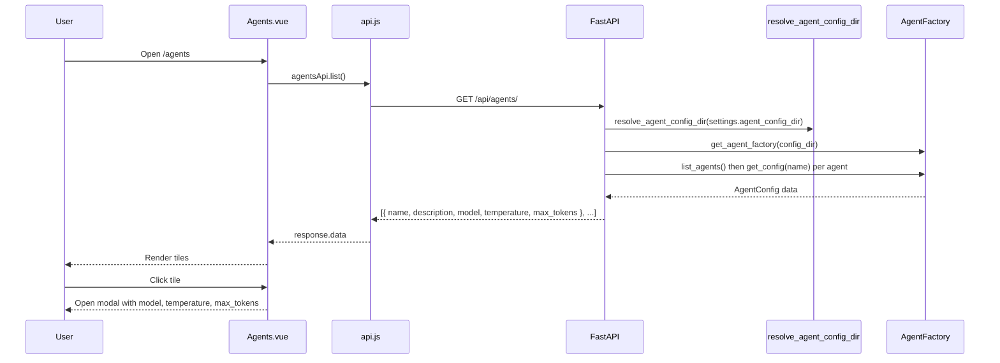

# Agent Management

The agent management feature provides a read-only UI to view configured agents. Data is loaded from the agent config directory; there is no database persistence.

## Purpose

- Expose which agents are available (e.g. GeneralAgent, TaskAgent, CodeAgent).
- Show per-agent metadata: name, description, model, temperature, max_tokens.
- Support operators and developers who need to see current agent configuration without editing YAML or config files.

## Data Source

Agent definitions come from the same source used by chat routing:

- **agent_core**: `AgentFactory` loads agents from the config directory (package resources and/or `config_dir`).
- **Backend**: Uses `resolve_agent_config_dir(settings.agent_config_dir)` and `get_agent_factory(config_dir)` so the list matches what the chat service uses.
- **No database**: Agents are not stored in PostgreSQL; the API reads from the factory on each request.

## Backend API

### List Agents

```http
GET /api/agents/
```

Returns a JSON array of agent config summaries. No query parameters.

**Response model** (`AgentConfigResponse`):

| Field         | Type    | Description                              |
| ------------- | ------- | ---------------------------------------- |
| name          | string  | Agent name (e.g. GeneralAgent)           |
| description   | string  | Human-readable description               |
| model         | string? | LLM model name                           |
| agent_class   | string? | Fully qualified agent class name         |
| temperature   | float?  | Sampling temperature (0.0 to 2.0)        |
| max_tokens    | int?    | Maximum tokens in the response            |

Secrets and large fields (e.g. `api_key`, `sys_prompt`) are excluded from the response.

**Example response:**

```json
[
  {
    "name": "GeneralAgent",
    "description": "General purpose assistant for conversation and queries that don't fit specialized categories.",
    "model": "mistralai/ministral-3-14b-reasoning",
    "agent_class": "agent_core.agents.base_agent.BaseAgent",
    "temperature": 0.4,
    "max_tokens": 4096
  }
]
```

**Errors:**

- `503 Service Unavailable`: Agent configuration could not be loaded (e.g. config directory missing or factory initialization failed).

## Frontend

### Route and Navigation

- **Route**: `/agents` (name: `Agents`).
- **Sidebar**: "Agents" link under the main nav (e.g. after Knowledge).
- **View**: `frontend/src/views/Agents.vue`.

### Page Behavior

1. **Load**: On mount, the page calls `GET /api/agents/` via `agentsApi.list()`.
2. **States**: Loading, error (with Retry), empty (no agents), and success with a grid of tiles.
3. **Tiles**: Each tile shows agent name and description. Tiles are clickable.
4. **Detail modal**: Clicking a tile opens a modal that shows:
   - Description
   - Model
   - Temperature
   - Max tokens  
   Missing values are shown as "—".

### Implementation Notes

- No Pinia store: the page keeps agents, loading, and error in local component state.
- API client: `agentsApi` in `frontend/src/services/api.js` with a `list()` method.
- Modal: Uses the shared `Modal` component from `@/components/common/Modal.vue`.

## Data Flow



## Files

| Layer   | Path | Purpose |
| ------- | ---- | ------- |
| Backend | `backend/app/api/schemas/agent.py` | `AgentConfigResponse` Pydantic model |
| Backend | `backend/app/api/agents.py` | GET /agents/ router |
| Backend | `backend/app/main.py` | Register agents router |
| Frontend | `frontend/src/services/api.js` | `agentsApi.list()` |
| Frontend | `frontend/src/views/Agents.vue` | Agents page and detail modal |
| Frontend | `frontend/src/router/index.js` | `/agents` route |
| Frontend | `frontend/src/components/common/Sidebar.vue` | Agents nav link |
| agent_core | `agent_core/agent_core/agents/agent_factory.py` | `get_config(agent_name)` used by backend |

## Out of Scope (Current Design)

- Persistence: agents are not stored in the database.
- Create, edit, or delete agents from the UI.
- Single-agent detail page (beyond the modal).
- Changing agent configuration from the frontend.
