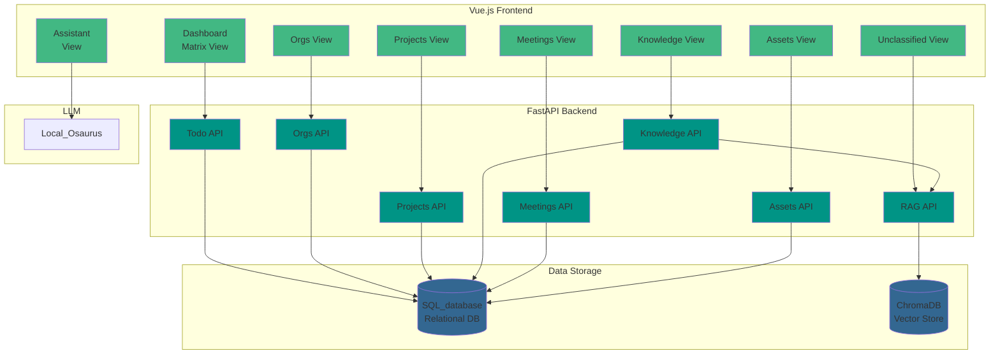
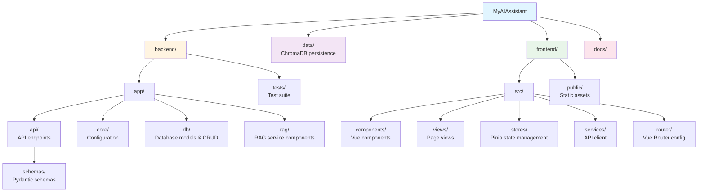
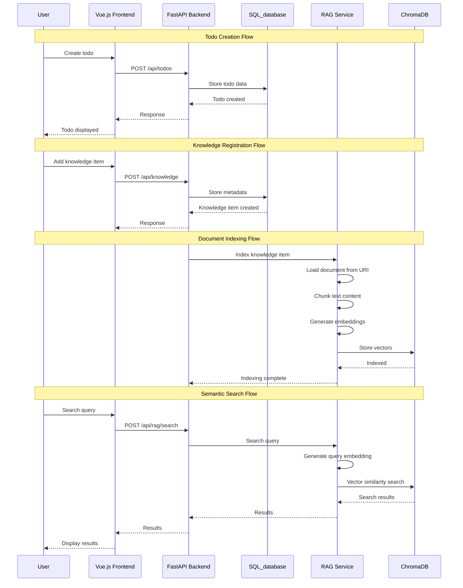

# Implementation Overview

MyAIAssistant is built with a modular architecture separating concerns across distinct components.

## Architecture Overview

## System Components

### Todo Management

The core task management system implementing the Eisenhower Matrix (Urgent/Important classification).

- RESTful API for CRUD operations
- Filtering by status, urgency, importance, category
- Canvas view endpoints for matrix quadrants
- SQLAlchemy ORM with async support

[Learn more about Todo Management](todo.md)

### Knowledge Management

The knowledge management helps managing personal content for supporting queries on knowledge corpus and helps on the task recommendations. The KM manages the following element:

- **Title**
- **Location/uri** of the source document
- **Status**: one of active, pending, indexed, error, archived
- **Document type**: Folder, website, markdown, pdf

Centralized storage for document metadata with support for various document types.

- Markdown files on local filesystem
- Website URLs for reference
- Category and tag-based organization
- Status tracking (active, pending, error, archived)

[Learn more about Knowledge Base](knowledge.md)

### Organization Management

Organizations represent external entities you work with. Each organization record includes:

- **Name**: Organization or company name
- **Stakeholders**: Key decision makers and contacts
- **Team**: Internal team members assigned to the organization
- **Strategy/Notes**: Overall relationship strategy and important notes
- **Related Products**: Products, services, or solutions relevant to the organization

### Project Management

Projects track specific work items within organizations. Each project includes:

- **Name**: Project identifier
- **Description**: Project goals and scope
- **Organization**: Optional link to parent organization
- **Status**: Lifecycle state (Draft, Active, On Hold, Completed, Cancelled)
- **Tasks**: Markdown-formatted bullet list of actionable items
- **Past Steps**: Historical record of completed actions

Projects can be filtered by organization and status. The Projects view displays active and draft counts for quick status assessment.

### Meeting Notes

Manage meeting notes with organization and project associations. Content is stored in markdown files with metadata tracked in the database.

- Meeting ID-based identification
- Links to organizations and projects
- Markdown content with live preview
- File-based storage with database references

[Learn more about Meeting Notes](meetings.md)

### Assets

Reusable assets developed within projects or tasks. Assets reference code repositories, documents, or other resources.

- Name and description metadata
- Reference URL to external resources
- Links to projects and tasks
- Searchable asset library

[Learn more about Assets](assets.md)

### RAG System

Retrieval-Augmented Generation for semantic search across the knowledge base.

- Document loading and text chunking
- Vector embeddings using sentence-transformers
- ChromaDB for vector storage
- Semantic search with category filtering

[Learn more about RAG System](rag.md)

### Chat

LLM-powered chat interface for intelligent interactions.

- Action item extraction from meeting notes
- Automatic knowledge-to-task linking
- Local model support via Ollama

[Learn more about Chat](chat.md)

### Agent Management

Read-only UI to view configured agents (name, description, model, temperature, max_tokens). Data is loaded from the agent config directory; no database persistence.

- List agents via GET /api/agents/
- Tile grid with detail modal on click
- Same config source as chat routing (AgentFactory)

[Learn more about Agent Management](agents.md)

### Agent Core

Config-driven framework for building agentic AI applications with unified LLM integration.

- YAML-based agent configuration
- Intelligent query routing and classification
- RAG integration for knowledge retrieval
- Extensible agent architecture

[Learn more about Agent Core](agent_core.md)

### Reporting

It helps to build weekly report on metrics like:

* Project started, actives, or closed
* Number of meetings
* Organization roadblocks addressed
* Assets completed or started
* Task created, completed

## AI Assistant CLI

The AI Assist CLI provides a comprehensive set of tools for managing AI Assistant workspaces and resources:

### Workspace Management

- **Initialize workspaces**: Create new workspaces with proper directory structure
- **Workspace status**: View workspace name, location, and directory status
- **List workspaces**: Discover and manage all registered workspaces
- **Clean workspace data**: Remove history, summaries, and cache data
- **Auto-detection**: Automatically detect workspace from current directory or parent directories (via workspace marker)

### Service Management

- **Run services**: Start backend and frontend services with a single command
- **Production mode**: Use Docker Compose to run services with pre-built images
- **Development mode**: Run services directly with `uv` and `npm` for hot-reload development
- **Workspace data**: Mount workspace data directory when running with Docker
- **Health checks**: Wait for services to be ready before completing startup

### Knowledge Base Management
- **Process documents**: Index documents from websites, folders, or markdown files
- **Batch processing**: Process multiple documents from JSON specification files
- **Collection management**: Organize documents into collections/categories
- **Statistics**: View RAG vector store statistics (chunks, documents, models)
- **Dry-run mode**: Validate and preview processing without making changes
- **Force re-indexing**: Re-index documents even when content is unchanged

### Global Resources
- **Cross-workspace resources**: Share prompts, agents, tools, and models across workspaces
- **Global configuration**: Set default LLM and embedding settings
- **Agent definitions**: Manage reusable agent configurations
- **Prompt templates**: Create and share prompt templates
- **Tool definitions**: Define and share custom tools

### Developer Experience
- **Rich output**: Beautiful terminal output with colors, tables, and progress indicators
- **Error handling**: Clear error messages and validation
- **Help system**: Comprehensive help text for all commands
- **Flexible paths**: Support for relative and absolute paths
- **Workspace registry**: Track and manage multiple workspaces

## Project Structure

## API Structure

All backend APIs follow RESTful conventions with versioned endpoints:

| Module | Base Path | Description |
| ------ | --------- | ----------- |
| Todos | `/api/todos` | Task management operations |
| Organizations | `/api/organizations` | Organization management |
| Projects | `/api/projects` | Project management |
| Knowledge | `/api/knowledge` | Knowledge item management |
| Meetings | `/api/meeting-refs` | Meeting notes management |
| Assets | `/api/assets` | Reusable asset management |
| RAG | `/api/rag` | Indexing and semantic search |
| Agents | `/api/agents` | List configured agents (read-only) |
| Metrics | `/api/metrics` | Dashboard metrics |
| Health | `/health` | Application health check |

## Data Flow

## Settings

Configuration may be set by user. The app/core/config.py supports a layered configuration:

* Default config (app/config.yaml) - shipped with the app, contains all settings with sensible defaults.
* User config (via CONFIG_FILE env var) - optional, only needs to include settings the user wants to override.
* Priority Order (highest wins)
    * Environment variables
    * .env file
    * User config file (CONFIG_FILE)
    * Default config (app/config.yaml)
    * Pydantic field defaults