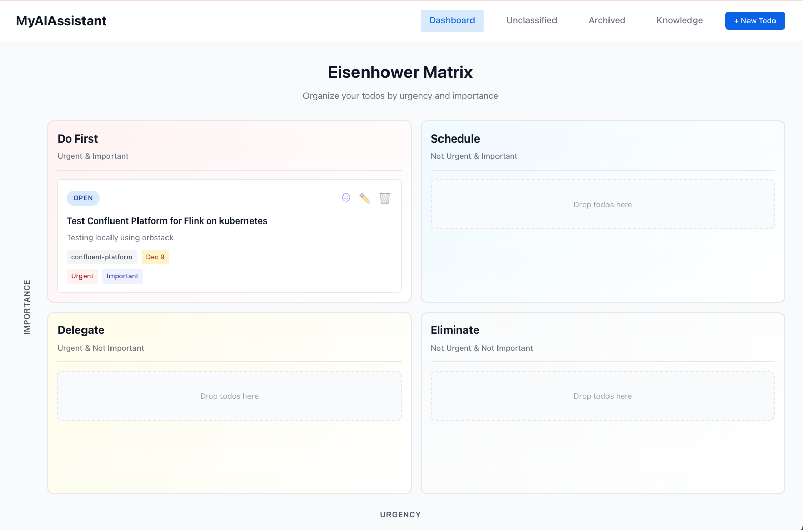

# MyAIAssistant

An intelligent personal productivity and knowledge management tool that integrates task management with a semantic knowledge base.

## Project Goal

MyAIAssistant helps users organize tasks, reference subject-matter knowledge, and leverage AI for semantic search, note summarization, and task extraction. The tool links knowledge artifacts to tasks to provide better context when addressing work.

Based on Stephen Covey's "7 Habits of Highly Effective People," the system helps manage priorities efficiently using the Eisenhower Matrix (Urgent/Important classification).



## Core Features

| Feature | Status | Description |
| ------- | ------ | ----------- |
| Kanban-style Todo Management | Complete | Todos categorized by Importance/Urgency (Eisenhower Matrix) |
| Knowledge Base | Complete | Metadata storage referencing documents, notes, and website links |
| Semantic Search (RAG) | Complete | AI-powered search across the knowledge base using embeddings |
| LLM Chat Support | Complete | AI chat for task planning and knowledge base queries |
| Task/Note Integration | Planned | Automatic linking of Todos to relevant knowledge artifacts |

## Technical Stack

| Layer | Technology | Purpose |
| ----- | ---------- | ------- |
| Frontend | Vue.js with Vite | User interface with drag-and-drop Todo visualization |
| Backend API | Python FastAPI | Async API for logic and data orchestration |
| Relational Database | SQLite (PostgreSQL-ready) | Storing Todos, user settings, knowledge metadata |
| Vector Database | ChromaDB | Semantic search and RAG using text embeddings |
| LLM Integration | OpenAI SDK | Semantic search, summarization, task generation |

## Architecture Overview

```
┌─────────────────────────────────────────────────────────────┐
│                      Vue.js Frontend                        │
│  ┌─────────────┐  ┌─────────────┐  ┌─────────────────────┐ │
│  │  Dashboard  │  │  Knowledge  │  │  Unclassified View  │ │
│  │  (Matrix)   │  │    View     │  │                     │ │
│  └─────────────┘  └─────────────┘  └─────────────────────┘ │
└─────────────────────────────────────────────────────────────┘
                            │
                            ▼
┌─────────────────────────────────────────────────────────────┐
│                    FastAPI Backend                          │
│  ┌─────────────┐  ┌─────────────┐  ┌─────────────────────┐ │
│  │  Todo API   │  │ Knowledge   │  │      RAG API        │ │
│  │  /api/v1/   │  │    API      │  │  (Index & Search)   │ │
│  └─────────────┘  └─────────────┘  └─────────────────────┘ │
└─────────────────────────────────────────────────────────────┘
                     │                        │
                     ▼                        ▼
          ┌──────────────────┐    ┌──────────────────────┐
          │     SQLite       │    │      ChromaDB        │
          │  (Relational DB) │    │   (Vector Store)     │
          └──────────────────┘    └──────────────────────┘
```

## Quick Start

### Using Docker Compose

```bash
docker-compose up -d
```

Access points:

- Frontend: http://localhost:80
- Backend API: http://localhost:8000
- API Documentation: http://localhost:8000/docs

### Local Development

Backend:

```bash
cd backend
uv sync
uv run uvicorn app.main:app --reload
```

Frontend:

```bash
cd frontend
npm install
npm run dev
```

## Project Principles

1. **Run locally** - All core features work without external API dependencies
2. **External configuration** - Environment-based configuration for flexibility
3. **Privacy-first** - Data stays on local infrastructure
4. **Efficient prioritization** - Eisenhower Matrix helps focus on high-impact work

