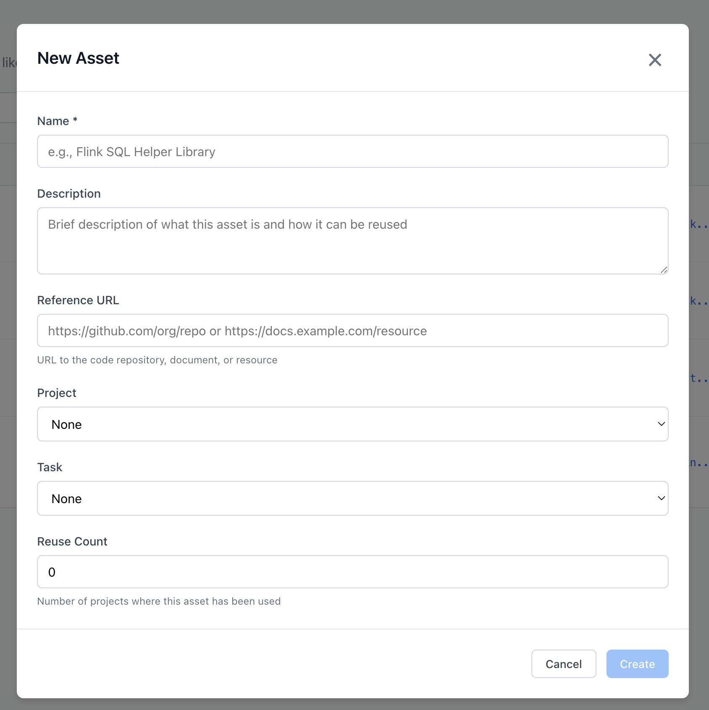

# Asset Management

Solution Engineer, and Technical contributors develop assets which can be reused from project to projects. 
The goal is to manage those assets and be able to track tasks related to assets.

## Asset management

The asset management page permits to create new asset, or update existing one.

## New Asset

Only the name is mandatory.

Thr URL can be used to reference a git repository.