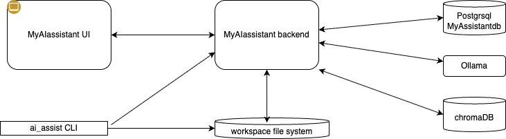

# User Guide

This guide covers how to use the main features of MyAIAssistant. This web application runs locally witihn the user's laptop. The backend is able to access the local file system, but isolated inside the concept of workspace. A CLI is provided to jumpstart the workspace creation and running the application. Docker images for frontend and backend are available to run with docker compose.

## Architecture of the solution

The following figure illustrates the components of this repository and how they work together:



* The **backend server**, exposes API to be able to manage Organizations, Projects, Tasks,TaskPlan, and knowledge references. It uses local or remote LLM, local vector store, and local SQL database.
* The **frontend single page application**, runs in a Web browser and interacts with the backend to manage day to day user interactions
* the **ai_assist** CLI, helps to manage workspace and other interesting commands to manage content.

## Getting Started

TO BE REWORKED

### Setup

* Go where you want to install the AI Assistant components, then:
   ```bash
   # If MYAIASSISTANT_DIR is not set it will be defaulted to $HOME/myaiassistant
   export MYAIASSISTANT_DIR=$(pwd)/myaiassistant
   curl -fsSL https://raw.githubusercontent.com/jbcodeforce/MyAIAssistant/main/install.sh | bash
   ```

   This script:

   - Checks for all dependencies
   - Prepare the ai_assist CLI
   - Sets up the installation `MYAIASSISTANT_DIR`

   The folder structure looks like. 
   ```sh
   ├── code
   └── workspaces
   ```

* After installation:
   ```bash
   cd $MYAIASSISTANT_DIR
   # Create one workspace, change first_ws as you want to name your workspace.
   ai_assist init ./workspaces/first_ws
   ```

* There are two possible modes of execution, the ai_assist cli supports:
=== "Development mode"
      This is to directly use python and nodejs for the backend and frontend components. For Local Development, have the following installed.
      
      - Python 3.12+
      - Node.js 18+
      - uv package manager

      ```sh
      ai_assist run --dev
      ```
   
=== "Docker"
      For minimum dependencies management, the application is packaged as two docker images.

      ```sh
      ai_assist run 
      ```

### User Workflow

1. Create task to track what need to be done. Reorganize over time using drag and drop, depending of the priority
1. Get helps from AI to brainstorm on task support and decomposition
1. Create project to group tasks to a major engagement
1. Create Organization to keep track of meeting notes, stakeholders, tasks and project. Ask AI to clean the content
1. Add specific knowledge to be used to improve AI support on task or other thing.
1. Add specific Agent with dedicated prompt and tools to improve workflow automation

--- 

## ai_assist CLI

The `ai_assist` CLI manages workspaces and knowledge resources from the command line. It provides an alternative to the web UI for automation, scripting, and batch operations and aim to prepare using the backend and frontend in an isolated workspace.

### Installation

```bash
cd ai_assist_cli
uv pip install -e .
```

### Features

| Command Group | Commands | Description |
|--------------|----------|-------------|
| `init` | - | Initialize a new workspace with local and global directories |
| `workspace` | `status`, `list`, `clean` | View workspace configuration, list registered workspaces, clean cache/history |
| `config` | `show`, `get`, `set`, `edit` | View and modify workspace configuration |
| `global` | `status`, `config`, `prompts`, `agents`, `tools`, `tree` | Manage shared resources in `~/.ai_assist` |
| `knowledge` | `process` | Batch process documents from JSON specification files |

### Quick Start

```bash
# Initialize workspace in current directory
ai_assist init

# Check workspace status
ai_assist workspace status

# Process knowledge documents from JSON file
ai_assist knowledge process documents.json

# View global resources
ai_assist global tree
```

### Directory Structure

The CLI creates two directory structures:

- **Global home** (`~/.ai_assist/`): Shared prompts, agents, tools, models, and cache
- **Workspace** (local): Configuration, vector database, history, summaries, and notes

### Knowledge Processing

Batch index documents using a JSON specification file:

```json
[
  {"document_type": "website", "uri": "https://example.com/docs", "collection": "docs"},
  {"document_type": "folder", "uri": "$HOME/notes", "collection": "notes"}
]
```

```bash
# Dry run to validate
ai_assist knowledge process docs.json --dry-run

# Process with verbose output
ai_assist knowledge process docs.json --verbose
```
