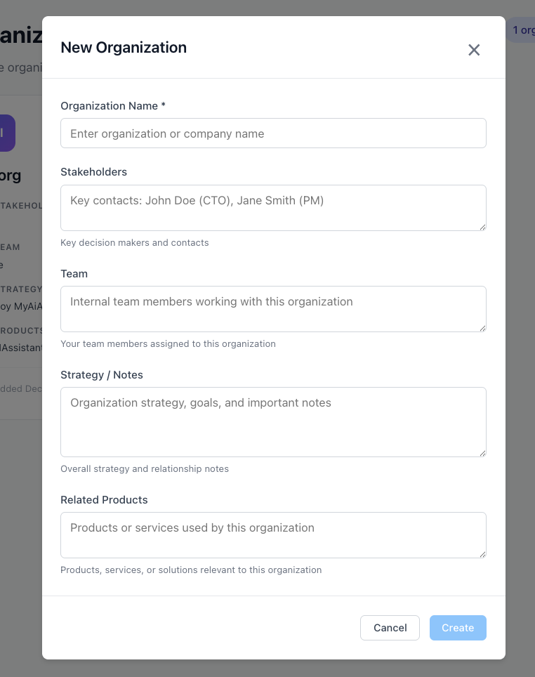
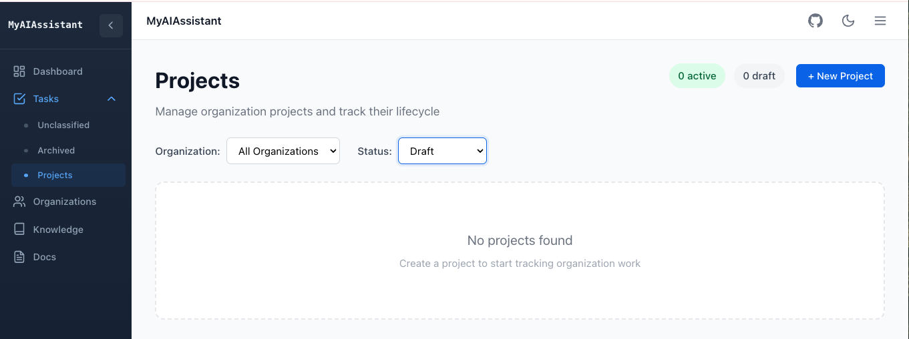
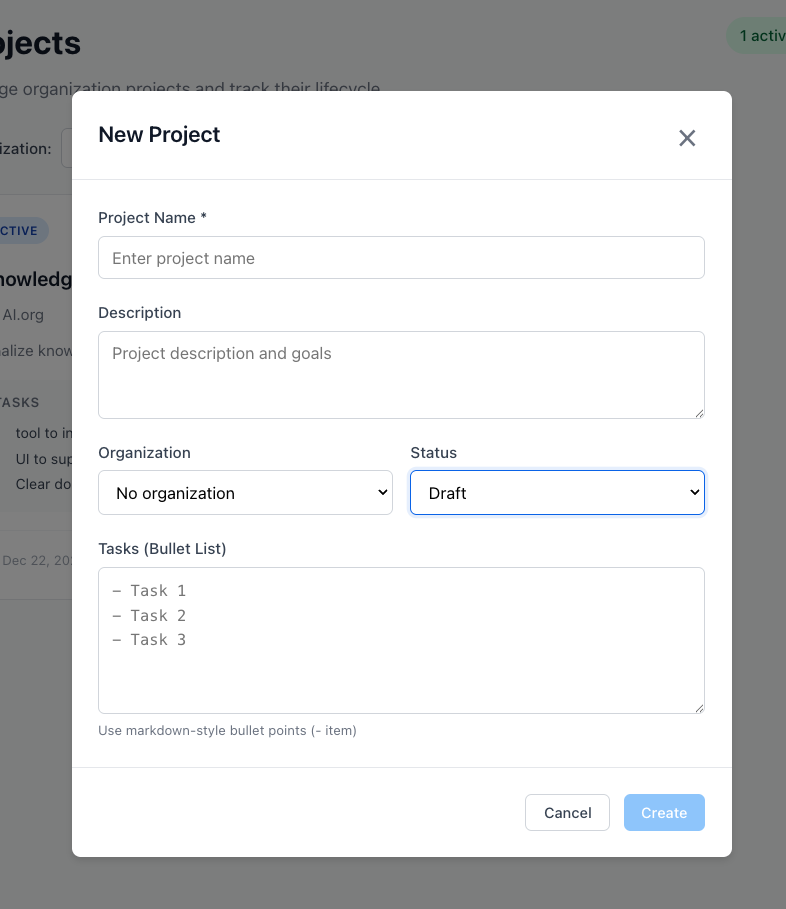
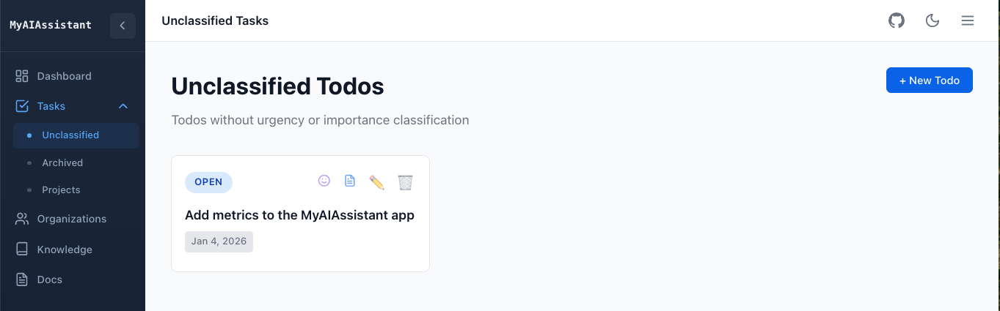

# User Guide

This guide covers how to use the main features of MyAIAssistant. As a web application, the configuration is set using a `config.yaml`, to specify where to access the database for the main entities, like tasks, organizations, documents, and where to access the vector store to keep document chunks and embeddings.

As of now this tool should run locally. LLM is done locally, or remotely using one of the existing AI service (OpenAI, Anthropic, Mistral, Openrouter.ai, Huggingface).

## Setup

### Option 1: One-line Install (No Clone Required)

```bash
curl -fsSL https://raw.githubusercontent.com/jbcodeforce/MyAIAssistant/main/install.sh | bash
```

This script:
- Checks for Docker and offers to install it if missing
- Downloads `docker-compose.yml`, creates a default `config.yaml` and scripts for database management
- Sets up the installation in `~/myaiassistant` (override with `MYAIASSISTANT_DIR`)

After installation:
```bash
cd ~/myaiassistant
docker-compose up -d
# Web UI: http://localhost:80
```

### Option 2: Clone and Run

```sh
git clone https://github.com/jbcodeforce/MyAIAssistant.git
cd MyAIAssistant
docker-compose up -d
# Web UI: http://localhost:80
```


### Prerequisites

#### For Docker Deployment - User

- Docker 20.10 or higher
- Docker Compose 2.0 or higher
- Ports 80 and 8000 available

#### For Local Development - Developer

- Python 3.12+
- Node.js 18+
- uv package manager (recommended)

### Configuration

There is a `config.yaml` to set access to the database and vector DB used. There is no need to change anything for first utilisation. There is a default database to support this user guide.

In the future, a user may change the following elements of the config.yaml, to separate knowledge and project per major context. Like a student working for his/her university projects, then later for a company during a internship. The student may use two databases for that. The same way, a consultant who wants to have separate databases for very different set of activities linked to different knowledge and customer industry:

```yaml
# Database settings
database_url: "sqlite+aiosqlite:////app/data/myaiassistant.db"

# Knowledge base / Vector store settings
chroma_persist_directory: "/app/data/chroma"
chroma_collection_name: "km-db"
```

* `database_url` can be another name to keep data for a separate context. The data folder will include the database file,
* `chroma_persist_directory:`: the reference to the folder to persiste vector store and document chunks
* `chroma_collection_name`: chrome collection name. From now there is one collection. It may be relevant in the future to support adding more collection and to query at the collection level.

### Launch the Application

#### Docker Compose (Recommended)

The fastest way to run the full application:

```bash
docker-compose up -d
```

Access points:

| Service | URL | Description |
| ------- | --- | ----------- |
| **Frontend** | [http://localhost:80](http://localhost:80) | Vue.js application. For user. |
| Backend API | http://localhost:8000 | FastAPI server. During this app development.|
| API Docs | http://localhost:8000/docs | Interactive Swagger UI. During this app development. |

#### Local Development

For development with hot reload:

=== "Backend"
   First start postgresql DB
   ```sh
   docker-compose up postgres -d
   ```

   Then the backend:
    ```bash
    cd backend
    uv sync
    uv run uvicorn app.main:app --reload
    ```

=== "Frontend"

    ```bash
    cd frontend
    npm install
    npm run dev
    ```


---

## Organization Management

The goal is to potentially link tasks to a project, and projects to an organization. An organization can be a customer, a university or a non-profit organization. 

It is not mandatory to use org and project to manage to do tasks, but it helps when you are engaged with different projects and want to classify tasks per project. An organization may also being fictive, just here to help organize work.

* From the left Navigation, select Organizations
   
* Create a new org:
   

   *Only the organization name is mandatory*. The rest may be updated later via the edit button. `Related Products` is to track the interests the org may have to our own products. This will be an interesting metrics to report on.

* Once one project is added to the organization it will be possible to navigate from the Orgranization tile, via the `View Projects` button, to the project view.


## Project Management

Project is here to group related tasks. It has a simple life cycle:


* From the left Navigation, select Project
   

* Create new project:
   
   
   *The tasks list section is NOT the tasks* that will be managed by the task manager. It is just an entry field for small tasks, or tasks related to other people for this project, or high level things to address. This is an optional field.

* Within the project home page, it is possible to filter the project per organizations, or status.
   


## Task Management

### The Eisenhower Matrix

The Dashboard displays Todos/Tasks in a 2x2 matrix based on urgency and importance:

| | Urgent | Not Urgent |
|---|--------|------------|
| **Important** | Do First | Schedule |
| **Not Important** | Delegate | Eliminate |


The state of a task is described in the diagram below:


### Creating Task

1. Click **+ New Todo**
2. Enter the todo title and optional description (which support markdown syntax)
3. Set urgency and importance levels. If kept unclassified, the task is created and user will need to update from the `Unclassified view`.
3. Optional, specify a project and a Due Date
4. Click **Create**


### Moving Task

Drag and drop todos between quadrants to change their priority classification.

### Completing Task

Update the todo card to mark it complete. Completed todos move to the archive.

### Unclassified Tasks

Todos without urgency/importance settings appear in the **Unclassified** view. Assign them to quadrants to include them in the matrix.



### Chat with Task

From the Dashboard, you can chat with the AI about specific tasks:

1. Click the chat icon (smiley) on any task card
      

2. Ask questions about how to approach the task
3. The AI may use your knowledge base to provide relevant context and suggestions (set the toggle on)
4. The result is a task plan that may be saved to the database and linked to the selected task

This helps when planning complex tasks by connecting your reference materials to your action items.

The response can build a plan, that may be saved in the database as task_plan.

### Task plan

At the task level, it is possible to access to a plan, elaborated by the AI. At the task tile, select the document icon, then the task plan is displayed using markdown layout, and can be edited.


---

## Knowledge Base

The Knowledge Base stores references to documents and web resources that you want to search and query using AI.

### Adding Knowledge Items

1. Navigate to the **Knowledge** page from the main navigation
2. Click **+ Add Knowledge** in the top right
3. Fill in the form:
      - **Title**: A descriptive name for the document
      - **Description**: Optional summary of the content
      - **Document Type**: Choose between Markdown or Website
      - **Source**: For Markdown, enter a local file path or URL. For websites, enter the URL
      - **Category**: Optional grouping (e.g., "Documentation", "Reference")
      - **Tags**: Comma-separated keywords for filtering
4. Click **Create** to save

### Indexing Documents

Before you can search or chat with your knowledge base, documents must be chunked,  indexed and embbedded:

- **Index a single item**: Click the index button (magnifying glass with plus) on any row
- **Index all items**: Click **Index All** in the header to index all active/pending items

Indexing function, extracts text from documents and creates vector embeddings for semantic search.

### Filtering Knowledge Items

Use the filter bar to narrow down items:

- **Type**: Filter by Markdown or Website
- **Status**: Filter by Active, Pending, Error, or Archived
- **Category**: Filter by assigned category
- **Tag**: Search by tag name

Click on any tag in the table to filter by that tag.

---

## Querying the Knowledge Base (RAG Chat)

Once you have indexed documents, you can ask questions and get AI-powered answers based on your knowledge base content.

### Starting a Chat Session

1. Go to the **Knowledge** page
2. Click the green **Ask AI** button in the header
3. A chat window opens where you can ask questions

### Asking Questions

Type your question in the input field and press Enter or click the send button. The AI will:

1. Search your indexed documents for relevant content
2. Use the most relevant passages as context
3. Generate an answer based on that context

### Suggested Prompts

When you first open the chat, you'll see suggested prompts to get started:

- "What topics are covered?" - Get an overview of your knowledge base
- "Summarize main points" - Get a summary of key information
- "Key concepts" - Identify important concepts from your documents

### Viewing Sources

Each AI response shows which documents were used to generate the answer:

1. Below the response, click **"X sources used"** to expand
2. View the source document title, relevance score, and snippet
3. Use this to verify the information or explore the original document

### Tips for Better Results

- **Be specific**: "How do I configure Docker deployment?" works better than "Docker?"
- **Ask one question at a time**: Complex multi-part questions may get incomplete answers
- **Reference context**: "Based on the API documentation, how do I..." helps focus the search
- **Index relevant documents**: The AI can only answer based on what's been indexed

### Conversation Context

The chat maintains conversation history within a session. You can:

- Ask follow-up questions that reference previous answers
- Clarify or drill down into topics
- Request more detail on specific points

The conversation resets when you close the chat window.

---

## Metrics

The metrics view presents a set of task and project metrics.

--- 

## Vectorize a folder


* In backend folder

```sh
# First run - creates all documents
uv run python -m tools.vectorize_folder /path/to/docs --extensions .md .txt .html --chunk-size 500 --category "Docs" --tags "api,reference"

# Re-run - skips unchanged files
uv run python -m tools.vectorize_folder /path/to/docs --category "Docs" --tags "api,reference"

# Force re-index everything
uv run python -m tools.vectorize_folder /path/to/docs --force

# View current collection stats
python -m tools.vectorize_folder --stats-only .
```

* Tools:
    ```sh
    cd backend
    uv run tools/vectorize_folder.py
    ```
