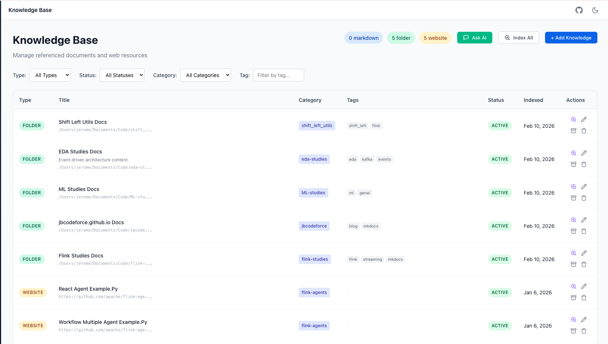
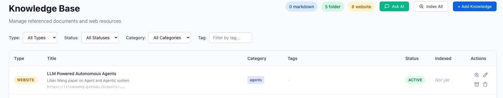
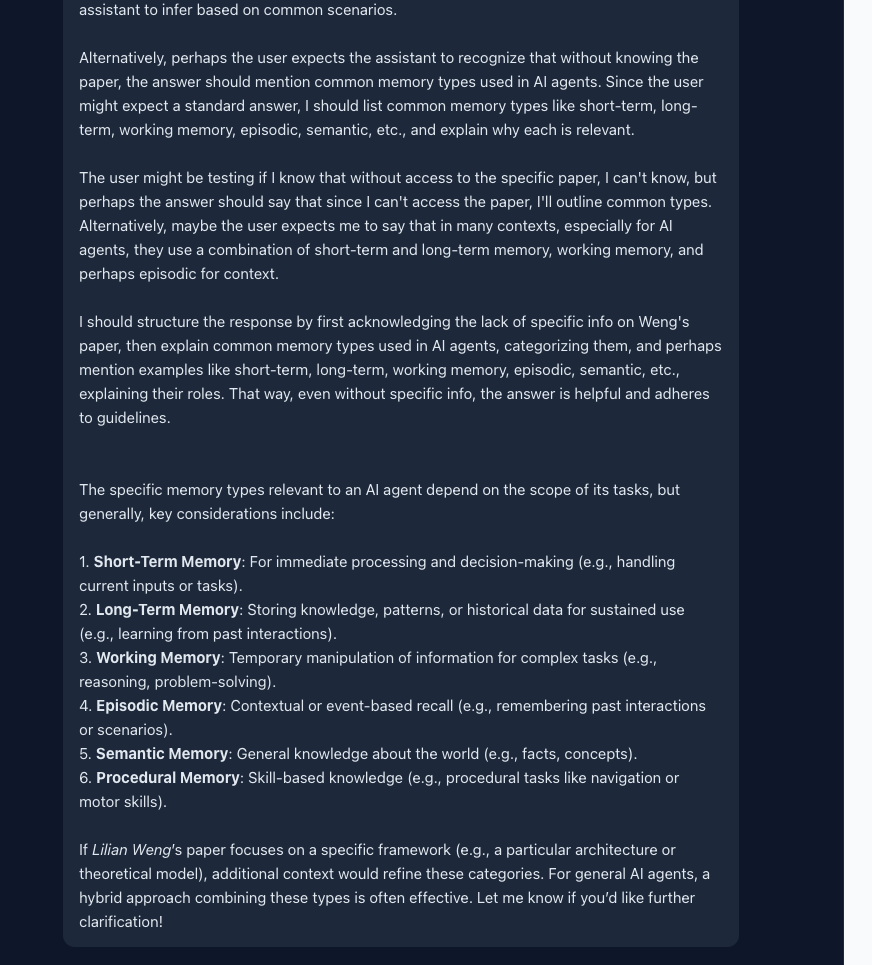

# Knowledge Management

The platform is also able to manage knowledge and RAG content. The approach is to keep metadata about the indexed materials, and then being able to query, brainstorm, create learning path, on the indexed materials.

Also the RAG can be used to support task decomposition.

## Knowledge Home Page

This page lists all the link to existing content.

## Create Knowledge Entry

An entry can be a folder including a hierarchy of sub-folders with md, txt or .doc files. 

1. Navigate to the **Knowledge** page from the main navigation
2. Click **+ Add Knowledge** in the top right
3. Fill in the form:

* Title, document type and source are mandatory
* When selecting a Markdown the Source can be a local file or a URL

* When selecting a website, the source is a URL

## Indexing the document

Once a knowledge reference is created, Clicking on the magnifier icon on the right side will start loading the content, chunk it into pieces, perform vector embedding and save the content in a vector store.

The completion of the processing displays a popup window with the number of chunks done.

- **Index a single item**: Click the index button (magnifying glass with plus) on any row
- **Index all items**: Click **Index All** in the header to index all active/pending items

## Filtering Knowledge Items

Use the filter bar to narrow down items:

- **Type**: Filter by Markdown or Website
- **Status**: Filter by Active, Pending, Error, or Archived
- **Category**: Filter by assigned category
- **Tag**: Search by tag name

Click on any tag in the table to filter by that tag.

## Working on Knowledge base

From the knowledge main page, clicking on `Ask AI` button will start the chat interface:

And the results includes content from the newly indexed paper.

## Querying the Knowledge Base (RAG Chat)

Once you have indexed documents, you can ask questions and get AI-powered answers based on your knowledge base content.

### Starting a Chat Session

1. Go to the **Knowledge** page
2. Click the green **Ask AI** button in the header
3. A chat window opens where you can ask questions

### Asking Questions

Type your question in the input field and press Enter or click the send button. The AI will:

1. Search your indexed documents for relevant content
2. Use the most relevant passages as context
3. Generate an answer based on that context

### Suggested Prompts

When you first open the chat, you'll see suggested prompts to get started:

- "What topics are covered?" - Get an overview of your knowledge base
- "Summarize main points" - Get a summary of key information
- "Key concepts" - Identify important concepts from your documents

### Viewing Sources

Each AI response shows which documents were used to generate the answer:

1. Below the response, click **"X sources used"** to expand
2. View the source document title, relevance score, and snippet
3. Use this to verify the information or explore the original document

### Tips for Better Results

- **Be specific**: "How do I configure Docker deployment?" works better than "Docker?"
- **Ask one question at a time**: Complex multi-part questions may get incomplete answers
- **Reference context**: "Based on the API documentation, how do I..." helps focus the search
- **Index relevant documents**: The AI can only answer based on what's been indexed

### Conversation Context

The chat maintains conversation history within a session. You can:

- Ask follow-up questions that reference previous answers
- Clarify or drill down into topics
- Request more detail on specific points

The conversation resets when you close the chat window.
