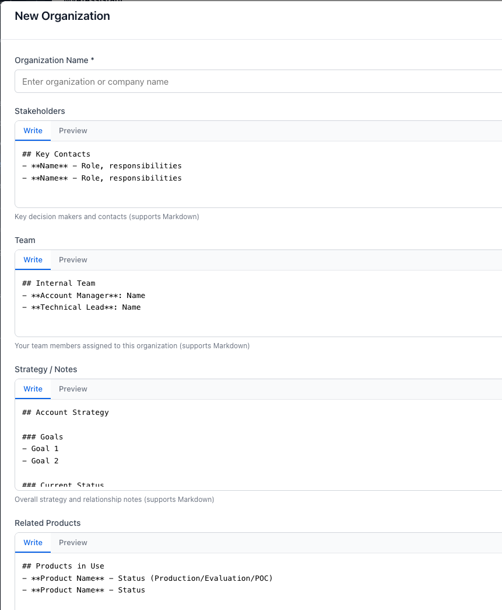
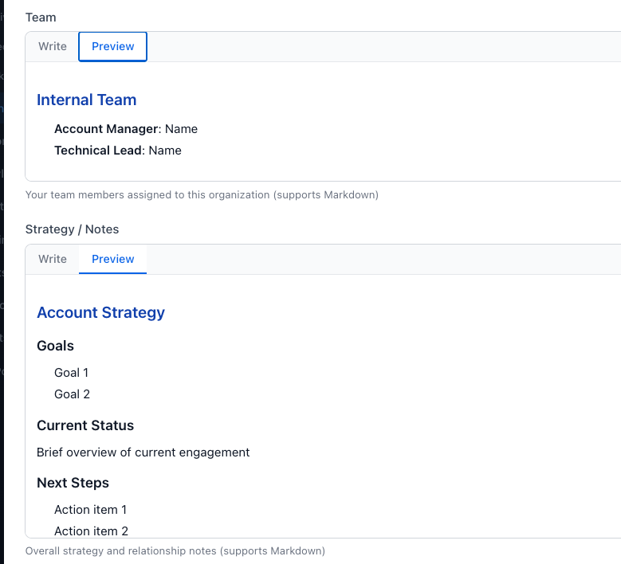
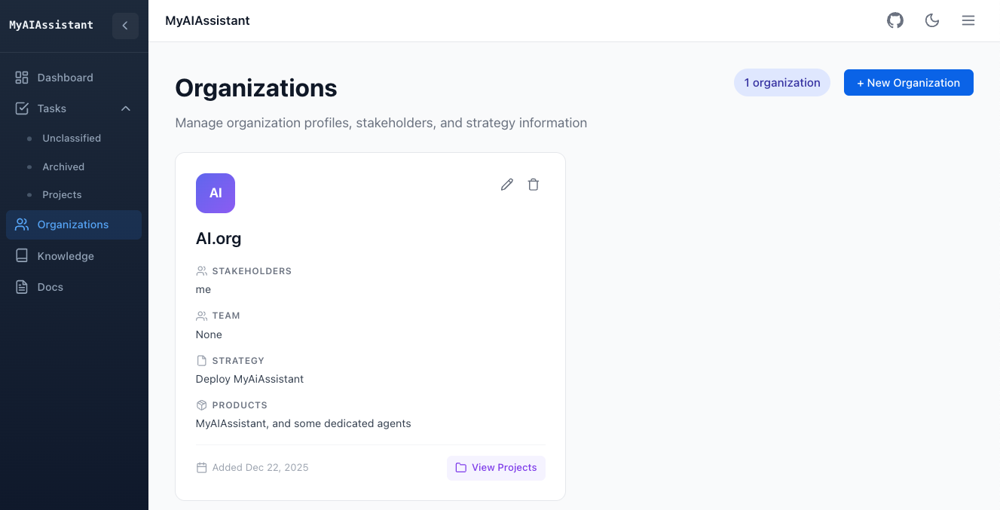

# Organization Management

Organization is a generic term for client, customer, university, Non-profit org... The core concept is to link persons, projects, tasks and assets to an organization.

It is not mandatory to use org and project to manage tasks, but it helps when you are engaged with different projects and want to classify tasks per project. An organization may also being fictive, just here to help organize work.

## Create Organization

Same user experience, the top-right button leads to create new organization:



* Only the `name` is mandatory, other fields may be added later.
* `Stakeholder` are persons within the organization
* `Team` are list of persons in our own org
* `Related products` are more for ISV where a list of names can be used.
* Each text field could be markdown content

The Preview tab presents the content as markdown.



* Once one project is added to the organization it will be possible to navigate from the Orgranization tile, via the `View Projects` button, to the project view.

## Work on Existing Organisations

From the organization view it is possible to do a read-only access, edit, or delete and organisation.



As an organization may have zero to n projects, it is possible to navigate from an organization to a project.

## Meeting notes in organization markdown

Organization strategy notes (and customer-style `index.md` files) can contain multiple dated meeting sections. Metrics counts headings such as:

```markdown
## Meeting 01/07
### Meeting 3/17
### Meeting Workshop 2/11/2026
```

Section titles without a date (`## Meeting notes`, `## Meetings`) are ignored. Headings that look like meetings but have no parseable date are **dirty** (for example `### Meeting 02/1026`).

### Audit a notes folder for dirty headings

Prefer the report script when cleaning data (per-organization summary and dirty line list):

```bash
cd backend

# Summary + dirty details
uv run python scripts/report_org_meetings.py /path/to/docs/notes

# Customer-style tree ({org}/index.md)
uv run python scripts/report_org_meetings.py /path/to/customers --dirty-only

# One org, include dated headings
uv run python scripts/report_org_meetings.py /path/to/notes --org acme -v
```

Exit code `1` means dirty headings remain. Fix those lines (use a real `M/D` or `M/D/YYYY` date), then re-run.

Alternatively, the integration audit walks the same files and fails on dirty headings (`-s` prints the full list):

```bash
cd backend

MEETING_METRICS_AUDIT_ROOT=/path/to/docs/notes \
  uv run pytest tests/it/test_meeting_heading_audit.py -m integration -s -v

MEETING_METRICS_AUDIT_ROOT=/path/to/customers \
  uv run pytest tests/it/test_meeting_heading_audit.py -m integration -s -v
```

See [Meeting notes implementation](../implementation/meetings.md#meeting-metrics-from-markdown-headings) for scanning rules and de-duplication.