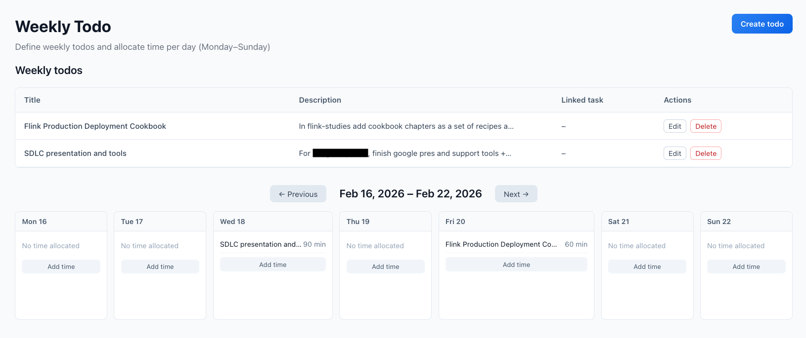

# Task Management

Task are thing user plan to do, so this is the classical to do definition and management. As a mono-user all the tasks are for the user to do. 

## Create New Task

* From the dashboard, `New Todo` button on top-right

* The Fields are self explanatory, and only the `title` is mandatory. In the backend an unique key will be created. 
* The description supports markdown syntax.
* Set the urgency and importance levels. If kept unclassified, the task is created and user will need to update it from the `Unclassified view`.
*` Categories` fields is used to tag the task so it can be easy to do so cross-cut reporting .
* A task can be linked to a project or to an asset.

The state of a task is described in the diagram below:
<figure markdown="span">

</figure>

## Dashboard

The Dashboard displays Todos/Tasks in a 2x2 matrix based on urgency and importance:

| | Urgent | Not Urgent |
|---|--------|------------|
| **Important** | Do First | Schedule |
| **Not Important** | Delegate | Eliminate |

* It supports drag-and-drop from one of the 4 quadrants to change the importance and urgency.

*The dashboard presents each quadran with a list of tasks or tiles view when the number of tasks is less or equals to 2.*

## Chat with Task

From the Dashboard, you can chat with the AI about specific tasks:

1. Click the chat icon (smiley) on any task card

      

2. Ask questions about how to approach the task
3. The AI may use your knowledge base to provide relevant context and suggestions (set the toggle on)
4. The result is a task plan that may be saved to the database and linked to the selected task

This helps when planning complex tasks by connecting your reference materials to your action items.

The response can build a plan, that may be saved in the database as task_plan.

## Completing Task

Update the todo card to mark it complete. Completed todos move to the archive.

## Non Classified Tasks

The are visible at the botton of the dashboard view but also in a dedicated Unclassified view, accessible from the left menu.

Unclassified means there is no urgency and importance dimension sets.

The icons signification for each task:

| Icon | Action |
|------|--------|
| Eye | Read Only view of the task for quick access |
| Talk | Open AI to chat against the content of the task. The content becomes the context of the LLM |

## Archived view

Is to see all the completed tasks. As there is an edit action for those tasks it is possible to re-open a task and work on it.

### Task plan

At the task level, it is possible to access to a plan, elaborated by the AI. At the task tile, select the document icon, then the task plan is displayed using markdown layout, and can be edited.

## Weekly Task View

It is interesting to plan ahead of a week. So Weekly tasks are special task, to be covered within a week and where some time could be allocated per day.

* Create a new weekly task with a simple title and descrption. 
* It is possible to link this weekly-todo to an existing task. The weekly todo is a container of allocated time within a week. 
* Once created the task can be drag-and-and dropped to a day. The default allocated time is 60 minutes.
* A task can be allocated to multiple days. Just more drag and drops.
* If no existing link was added during the creation, the tool create a task with the same title and description so it can also be organized by priority, or link to an asset or project.